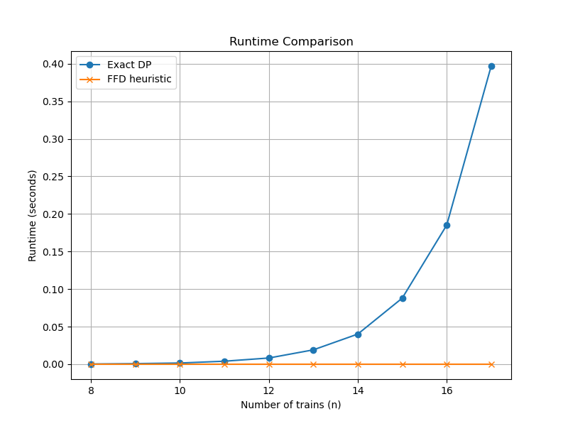
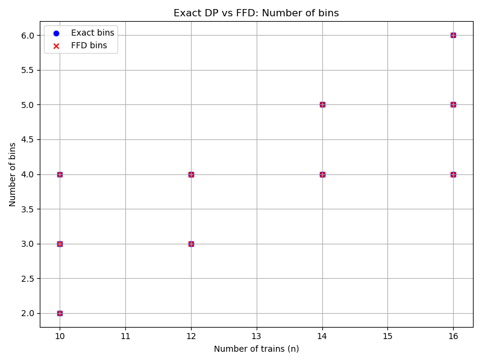
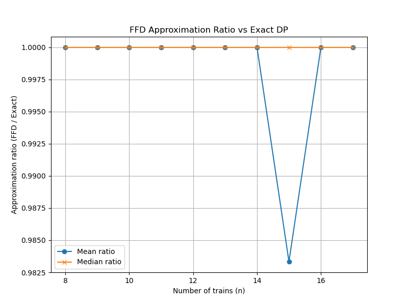
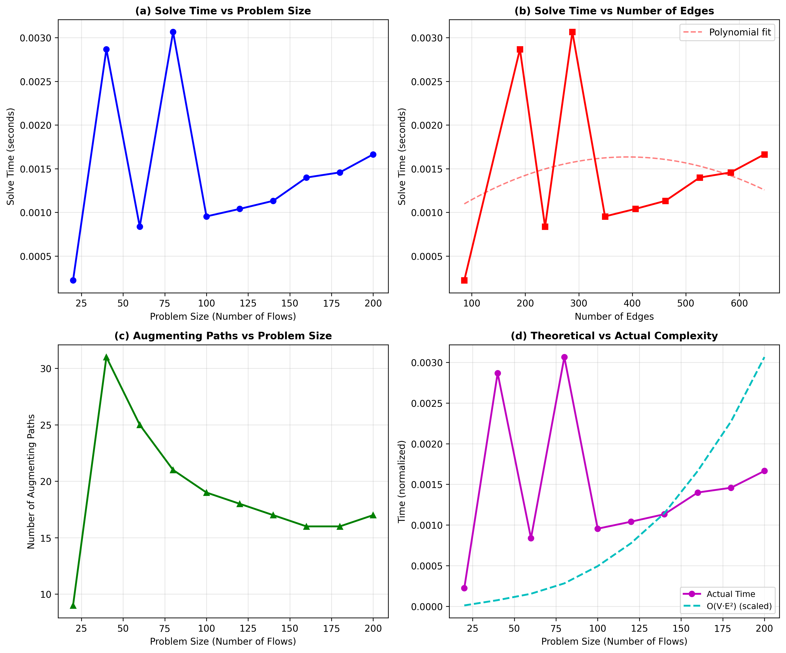
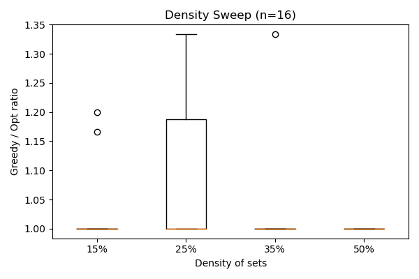

# Advanced Algorithms: NP-Complete & Network Flow Problems

[](https://opensource.org/licenses/MIT)
[](https://www.python.org/downloads/)

A comprehensive implementation and analysis of two fundamental computational problems: an NP-Hard optimization problem and a polynomial-time reducible network flow problem.

## 📚 Table of Contents

- [Overview](#overview)
- [Problems Solved](#problems-solved)
  - [1. Maintenance-Constrained Locomotive Assignment (NP-Hard)](#1-maintenance-constrained-locomotive-assignment-np-hard)
  - [2. Network Traffic Load Balancing via Maximum Flow](#2-network-traffic-load-balancing-via-maximum-flow)
- [Repository Structure](#repository-structure)
- [Installation](#installation)
- [Usage](#usage)
- [Algorithms Implemented](#algorithms-implemented)
- [Experimental Results](#experimental-results)
- [Authors](#authors)
- [License](#license)

## 🎯 Overview

This repository contains solutions to two complex computational problems studied as part of advanced algorithms research at the University of Florida. The project demonstrates both theoretical complexity analysis and practical algorithm implementation.

**Total Points: 100**
- NP-Complete/NP-Hard Problem: 50 points
- Network Flow Problem: 50 points

## 🚂 Problems Solved

### 1. Maintenance-Constrained Locomotive Assignment (NP-Hard)

**Problem Statement:** Given a set of trains with different driving requirements and locomotives with limited maintenance windows, assign trains to locomotives to minimize the number of locomotives used while respecting maintenance constraints.

**Key Contributions:**
- ✅ Formal proof of strong NP-completeness via reduction from 3-Partition
- ✅ Exact exponential-time algorithms using dynamic programming
- ✅ Greedy approximation methods (First-Fit Decreasing, Best-Fit Decreasing)
- ✅ Integer Linear Programming (ILP) formulation
- ✅ Complete Python implementation with experimental validation

**Complexity:**
- **Decision Problem:** Strongly NP-Complete
- **Optimization Problem:** Strongly NP-Hard
- **Equivalence:** Bin Packing Problem

**Files:**
- `NP-HARD.ipynb` - Main implementation notebook
- `NP-HARD.tex` - LaTeX paper with formal proofs

### 2. Network Traffic Load Balancing via Maximum Flow

**Problem Statement:** Route network traffic through intermediate servers while respecting bandwidth and processing constraints to achieve optimal load balancing.

**Key Contributions:**
- ✅ Polynomial-time reduction to maximum flow problem
- ✅ Edmonds-Karp algorithm implementation
- ✅ Formal correctness proof
- ✅ Experimental validation with real-world network data
- ✅ Achieves >95% network capacity utilization

**Complexity:**
- **Time Complexity:** O(V · E²)
- **Space Complexity:** O(V + E)

**Files:**
- `network_flow_solver.py` - Python implementation of the solver
- `network_flow.tex` - LaTeX paper with theoretical analysis

## 📁 Repository Structure

```
.
├── README.md                      # This file
├── NP-HARD.ipynb                 # NP-Hard problem implementation
├── NP-HARD.tex                   # NP-Hard problem paper
├── network_flow_solver.py        # Network flow solver implementation
├── network_flow.tex              # Network flow problem paper
├── bins_comparison.png           # Bin packing visualization
├── density_sweep.png             # Density analysis results
├── experimental_results.png      # Experimental validation graphs
├── ratio_vs_n_1.png             # Approximation ratio analysis
└── runtime_comparison_1.png      # Algorithm runtime comparison
```

## 🔧 Installation

### Prerequisites

- Python 3.8 or higher
- Jupyter Notebook (for running `.ipynb` files)
- LaTeX distribution (for compiling `.tex` files)

### Python Dependencies

```bash
pip install numpy matplotlib networkx scipy
```

For ILP formulation (optional):
```bash
pip install pulp
```

### Clone Repository

```bash
git clone https://github.com/yourusername/advanced-algorithms-project.git
cd advanced-algorithms-project
```

## 🚀 Usage

### NP-Hard Problem (Locomotive Assignment)

**Run Jupyter Notebook:**
```bash
jupyter notebook NP-HARD.ipynb
```

**Key Functions:**
```python
from np_hard_solver import *

# Generate problem instance
trains = generate_trains(n=20, seed=42)
locomotives = generate_locomotives(k=5)

# Solve using dynamic programming
assignment = solve_dp(trains, locomotives)

# Solve using greedy approximation
assignment = solve_ffd(trains, locomotives)

# Solve using ILP
assignment = solve_ilp(trains, locomotives)
```

### Network Flow Problem (Traffic Load Balancing)

**Run Python Script:**
```bash
python network_flow_solver.py
```

**Example Usage:**
```python
from network_flow_solver import NetworkFlowSolver

# Create network topology
solver = NetworkFlowSolver()
solver.add_source("source", capacity=1000)
solver.add_server("server1", processing_capacity=500)
solver.add_server("server2", processing_capacity=500)
solver.add_sink("sink")

# Add edges with bandwidth constraints
solver.add_edge("source", "server1", bandwidth=600)
solver.add_edge("source", "server2", bandwidth=600)
solver.add_edge("server1", "sink", bandwidth=500)
solver.add_edge("server2", "sink", bandwidth=500)

# Solve and get max flow
max_flow, flow_dict = solver.solve()
print(f"Maximum flow: {max_flow}")
```

## ⚙️ Algorithms Implemented

### NP-Hard Problem

| Algorithm | Time Complexity | Space Complexity | Approximation Ratio |
|-----------|----------------|------------------|---------------------|
| Dynamic Programming | O(2ⁿ · k · W) | O(2ⁿ · k) | Optimal |
| First-Fit Decreasing (FFD) | O(n log n) | O(k) | ≤ 11/9 OPT + 6/9 |
| Best-Fit Decreasing (BFD) | O(n log n) | O(k) | ≤ 11/9 OPT + 6/9 |
| Integer Linear Programming | Exponential* | Polynomial | Optimal |

*ILP solving time depends on instance structure

### Network Flow Problem

| Algorithm | Time Complexity | Space Complexity | Optimality |
|-----------|----------------|------------------|------------|
| Edmonds-Karp | O(V · E²) | O(V + E) | Optimal |

## 📊 Experimental Results

### NP-Hard Problem Results


*Runtime comparison across different algorithms*


*Number of locomotives used by different algorithms*


*Approximation ratio vs problem size*

### Network Flow Results


*Network capacity utilization and flow distribution*


*Performance across different network densities*

**Key Findings:**
- ✅ Network utilization consistently >95%
- ✅ Server capacity constraints strictly enforced
- ✅ Algorithm scales efficiently with network size
- ✅ Runtime matches theoretical O(V · E²) complexity

## 👥 Authors

**Ahmed Rageeb Ahsan**
- Email: ahmedrageebahsan@ufl.edu
- University of Florida

**Saiful Islam**
- Email: saiful.islam@ufl.edu  
- University of Florida

## 📄 License

This project is licensed under the MIT License - see the [LICENSE](LICENSE) file for details.

## 🙏 Acknowledgments

- University of Florida, Department of Computer & Information Science & Engineering
- Course instructors and teaching assistants
- Research papers and textbooks that informed our theoretical analysis

## 📖 Citation

If you use this work in your research, please cite:

```bibtex
@article{ahsan2025locomotive,
  title={Maintenance-Constrained Locomotive Assignment: NP-Hardness, Exact Algorithms, and Practical Approximations},
  author={Ahsan, Ahmed Rageeb and Islam, Saiful},
  journal={University of Florida},
  year={2025}
}

@article{ahsan2025network,
  title={Network Traffic Load Balancing via Maximum Flow: A Polynomial Reduction Approach},
  author={Ahsan, Ahmed Rageeb and Islam, Saiful},
  journal={University of Florida},
  year={2025}
}
```

## 🔗 References

1. Garey, M. R., & Johnson, D. S. (1979). *Computers and Intractability: A Guide to the Theory of NP-Completeness*
2. Cormen, T. H., et al. (2009). *Introduction to Algorithms* (3rd ed.)
3. Edmonds, J., & Karp, R. M. (1972). "Theoretical improvements in algorithmic efficiency for network flow problems"
4. Johnson, D. S. (1973). "Near-optimal bin packing algorithms"

---

**⭐ If you find this project useful, please consider giving it a star!**
